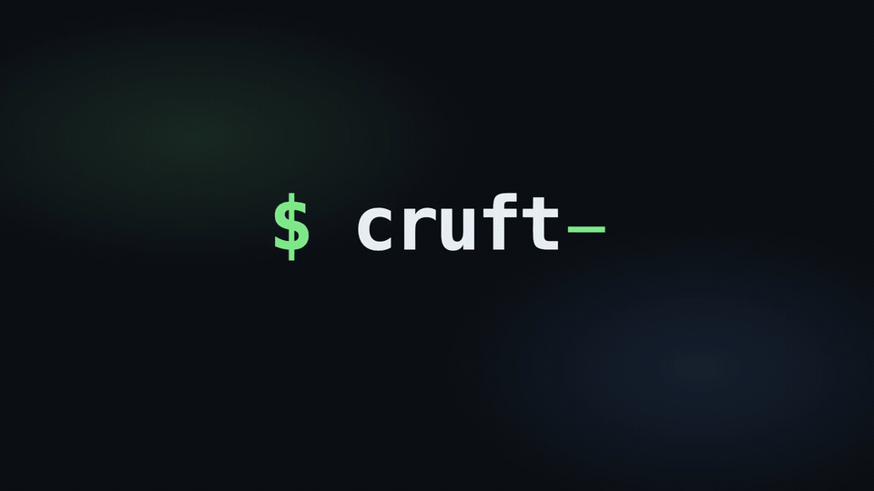

<h1 align="center">C&nbsp;R&nbsp;U&nbsp;F&nbsp;T</h1>
<p align="center"><em>decruft your dev laptop.</em></p>

<p align="center">
  <a href="assets/cruft-promo.mp4"></a>
</p>

<p align="center">
  <code>~/Library/Caches</code>&nbsp;&nbsp; <code>~/Library/Developer/Xcode</code>&nbsp;&nbsp; <code>~/.terraform</code>&nbsp;&nbsp; <code>~/.gradle/caches</code><br>
  <code>~/.cargo</code>&nbsp;&nbsp; <code>~/.npm</code>&nbsp;&nbsp; <code>~/.colima</code>&nbsp;&nbsp; <em>…and a dozen more</em>
</p>

<p align="center"><b>cruft finds every one, shows you why each is safe to delete, and clears only what you tick.</b></p>

<p align="center">one Go binary · 57 cleaners · deletes on confirm · <code>--safe</code> for 7-day undo · macOS</p>

<p align="center">
  <a href="https://github.com/sachincool/cruft/actions/workflows/ci.yml"></a>
  <a href="https://github.com/sachincool/cruft/releases"></a>
  <a href="LICENSE"></a>
</p>

<p align="center">
  
</p>

---

Your Mac says the disk is full. Not because of your code — because of the
caches every dev tool quietly piles up and never cleans. After a year of
real work you're probably sitting on:

- 5 GB of Xcode `DerivedData` from builds you'll never run again
- 3 GB of old Homebrew versions you already upgraded past
- a `.terraform/` and `.terragrunt-cache/` in each of a dozen infra repos you cloned once
- 1 GB of npm cache from a project you opened twice
- a JetBrains index for a project you deleted months ago

You know most of it is safe to delete. The problem is remembering where it
all lives, and knowing which bits cost you a 15-minute rebuild if you guess wrong.

`cruft` knows. It scans for all of it at once, shows you what it found and why
each thing is safe to remove, and deletes only what you tick.

> On my M1, the default profile cleared **13.2 GB across 19 cleaners in 11 seconds.** Adding `--include-risky` turned up another 620 MB.

## Install

**Homebrew** — recommended:

```sh
brew install sachincool/tap/cruft
```

**Go** — build from source:

```sh
go install github.com/sachincool/cruft/cmd/cruft@latest
```

5.6 MB binary, single file, zero runtime deps.

## Use it

```sh
cruft                          # interactive TUI: pick, confirm, done
cruft run --all                # non-interactive, deletes on confirm
cruft run --all --dry-run      # preview only, changes nothing
cruft run --all --safe         # delete via 7-day recycle (`cruft restore` works)

cruft doctor                   # what's installed, what's busy
cruft explain xcode-derived    # what one cleaner actually does
cruft glossary                 # define every term cruft uses
cruft last                     # what the last run did
```

Three keys you'll use in the TUI:

| key | what |
|---|---|
| `space` | toggle the cleaner under the cursor |
| `?` | what does this cleaner do? |
| `d` / `s` | flip `--dry-run` / `--safe` mid-session |

### Shell completions

cruft completes both its subcommands and cleaner names — `cruft run <Tab>`
suggests `npm`, `docker`, `xcode-derived`, and the rest.

```sh
source <(cruft completion zsh)      # zsh  — add to ~/.zshrc
source <(cruft completion bash)     # bash — add to ~/.bashrc
cruft completion fish | source      # fish
```

## What it cleans

57 cleaners across six families. Run `cruft list` for the full set.

| | |
|---|---|
| **JS / TS** | npm · pnpm · yarn · bun · deno · nvm |
| **Python** | pip · uv · conda · poetry · pipenv · pyenv |
| **JVM / Android** | gradle · gradle-wrapper · maven · sbt (Ivy) · Android SDK |
| **Apple / Swift** | Xcode DerivedData · archives · simulators · device support · caches · Swift PM · CocoaPods · Carthage |
| **Other langs** | cargo · Go module cache · gem · bundler · composer · flutter/pub · bazel · mise |
| **IaC state** | terraform · terragrunt · pulumi |
| **Containers** | docker · docker volumes · colima |
| **AI / ML** | ollama · huggingface |
| **Editors / tools** | VS Code · Cursor · Windsurf · JetBrains caches · JetBrains system · playwright · puppeteer · prisma |
| **Game engines** | unity · godot |
| **macOS / cloud** | Homebrew · Library/Caches (allowlist) · Slack · Trash · AWS CLI |
| **Project artifacts** | stale `node_modules/` · `target/` · `build/` · `.build/` · `vendor/` · `dist/` under projects you haven't touched in `--stale-days` |

Risky cleaners (Ollama / HuggingFace model weights, Docker volumes, JetBrains system indexes, Xcode archives, Trash, …) stay opt-in. Each one prints its own one-line reason in `cruft doctor` and `cruft explain`. Surface them with `--include-risky` or `--profile aggressive`.

> **Why cruft over a menu-bar app?** Same breadth, but cruft is a single scriptable binary: `--dry-run` to preview, `--safe` for a 7-day undo, a JSONL audit log (`cruft history`), `--json` output for CI, and a busy-process guard that refuses to wipe a cache while its tool is running. No GUI, no daemon, no telemetry.

> **What it leaves alone:** `~/.android/avd` (emulator disks hold real user data, not a rebuildable cache), installed language-version directories under `nvm`/`pyenv`/`mise`, and your `~/.aws` credentials/config — only the resolution cache is touched.

## What it doesn't do

- Touch your code, your dotfiles, or anything outside a cleaner's declared paths.
- Run as root.
- Follow a symlink out of an allowed directory.
- Delete a cleaner's cache while the matching tool is running (`npm` skips if `node` is running, `terraform` skips if `terraform` is, etc.).
- Cover Linux or Windows yet.

## Is this safe?

Short answer: yes — and you can always check its work.

- **It only touches paths it already knows.** Every cleaner lists the exact
  directories it owns. cruft follows symlinks to where they really point,
  then refuses to delete anything that isn't on the list. No globs, no
  "delete everything under here."
- **The risky stuff is opt-in.** Eight cleaners are marked *risky* because what
  they delete takes a while to come back (a JetBrains re-index, an Xcode
  archive, tens of GB of Ollama model weights). They never run by default, and
  each one tells you why it's risky.
- **It waits for your tools.** If `node` is running, the npm cleaner skips
  this round. If Xcode is open, DerivedData is left alone — so nothing gets
  pulled out from under a running build.
- **Every run leaves a receipt.** Each action, dry-runs included, writes a
  line of JSON to `~/.local/share/cruft/runs/`. Read it back any time with
  `cruft last` or `cruft history`.
- **You can undo it.** Run with `--safe` and deletions go to a recycle bin for
  7 days — `cruft restore <run-id>` brings them back. It's off by default
  because most of what cruft cleans just regenerates the next time you use the tool.

## Profiles

A profile is just how much cruft is willing to clean:

```sh
cruft --profile conservative   # only caches that come back in seconds
cruft --profile balanced       # default — everything that's safe
cruft --profile aggressive     # also cleans the risky stuff, automatically
```

Even on the default profile, risky cleaners still show up in the results so
you can see what's there. They just don't get deleted unless you opt in.

## JSON output

```sh
cruft run --all --dry-run --json | jq '[.results[] | select(.bytes_freed > 0)] | sort_by(-.bytes_freed)'
```

Every subcommand that prints a summary takes `--json`. Schema lives in [`docs/json-output.md`](docs/json-output.md). Useful for before/after disk reports across a fleet.

## Why not just `rm -rf`?

Because there are 25 different paths spread across `~/Library/`, `~/.cache/`, `~/.cargo/`, `~/.gradle/`, `~/Library/Developer/Xcode/`, `~/.colima/`, and a dozen more, and you don't want to type them wrong at midnight. cruft has them registered, declares which are risky, knows which tools have to be quiet first, and writes a receipt you can `jq`.

## Develop

```sh
make check        # gofmt, vet, tests
make build        # bin/cruft
make snapshot     # local goreleaser snapshot
```

Add a cleaner: copy any file under `internal/cleaner/<category>/`, implement the four-method interface (`Detect` / `BusyProcesses` / `Scan` / `Execute`), call `cleaner.Register(&yours{})` in `init()`. Open a PR with a one-line note on what the cleaner owns and whether it's risky (and why).

## Status

macOS only. ~5,600 lines of Go across 90 files. 57 cleaners. Used on the maintainer's laptop. PRs welcome — especially Linux support, more cleaners, and tests with real fixtures.

License: MIT
